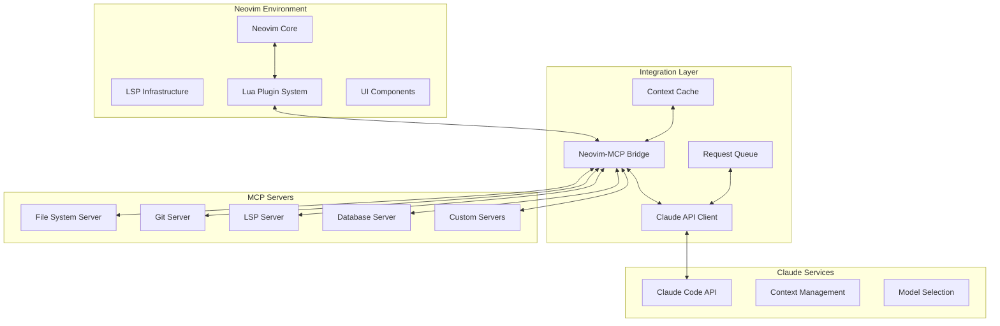

# Claude Code & MCP Integration Design for Neovim

## Executive Summary

This document outlines the architecture and implementation design for integrating Claude Code and Model Context Protocol (MCP) servers with Neovim, creating a powerful AI-assisted development environment that leverages Neovim's extensibility with Claude's intelligence capabilities.

## 1. System Architecture Overview



## 2. Core Components

### 2.1 Neovim-MCP Bridge Plugin

**Location**: `lua/claude-mcp/`

```lua
-- Core bridge module structure
claude-mcp/
├── init.lua           -- Main entry point
├── bridge/
│   ├── server.lua     -- MCP server management
│   ├── client.lua     -- Claude API client
│   └── protocol.lua   -- Protocol handlers
├── providers/
│   ├── filesystem.lua -- File system operations
│   ├── git.lua        -- Git integration
│   ├── lsp.lua        -- LSP coordination
│   └── context.lua    -- Context building
├── ui/
│   ├── floating.lua   -- Floating windows
│   ├── split.lua      -- Split windows
│   └── telescope.lua  -- Telescope integration
└── config/
    ├── defaults.lua   -- Default configuration
    └── keymaps.lua    -- Keybinding definitions
```

### 2.2 MCP Server Architecture

```yaml
mcp_servers:
  filesystem:
    type: built-in
    capabilities:
      - read_file
      - write_file
      - list_directory
      - search_content
    transport: stdio
    
  git:
    type: built-in
    capabilities:
      - diff
      - log
      - status
      - commit_info
    transport: stdio
    
  lsp_bridge:
    type: custom
    capabilities:
      - diagnostics
      - symbols
      - references
      - definitions
    transport: websocket
    
  project_context:
    type: custom
    capabilities:
      - workspace_analysis
      - dependency_graph
      - test_coverage
    transport: grpc
```

### 2.3 Claude API Integration

```lua
-- API client configuration
local claude_client = {
  endpoint = "https://api.anthropic.com/v1/messages",
  model = "claude-3-opus-20240229",
  max_tokens = 4096,
  temperature = 0.7,
  
  -- Context window management
  context = {
    max_size = 200000,
    rolling_window = true,
    compression = true,
  },
  
  -- Request optimization
  batching = {
    enabled = true,
    max_batch = 5,
    timeout = 100, -- ms
  },
}
```

## 3. API Interfaces

### 3.1 Neovim Plugin API

```lua
-- Public API for Neovim users
local M = {}

-- Initialize the Claude-MCP integration
function M.setup(opts)
  -- Configuration merging
  -- Server initialization
  -- Event handler registration
end

-- Send a query to Claude with current context
function M.query(prompt, opts)
  opts = opts or {}
  return {
    context = opts.context or M.get_context(),
    model = opts.model or config.default_model,
    stream = opts.stream or false,
  }
end

-- Code generation with context awareness
function M.generate_code(spec, opts)
  -- Gather relevant context
  -- Send to Claude with MCP context
  -- Return generated code
end

-- Interactive chat interface
function M.chat(opts)
  -- Open chat window
  -- Maintain conversation context
  -- Handle streaming responses
end

-- Code review and suggestions
function M.review(opts)
  -- Analyze current buffer/selection
  -- Get suggestions from Claude
  -- Display in preview window
end

return M
```

### 3.2 MCP Server Protocol

```typescript
// TypeScript interface definitions for MCP protocol
interface MCPRequest {
  id: string;
  method: string;
  params: any;
  metadata?: {
    source: 'neovim';
    buffer_id?: number;
    file_path?: string;
    position?: [number, number];
  };
}

interface MCPResponse {
  id: string;
  result?: any;
  error?: {
    code: number;
    message: string;
    data?: any;
  };
}

interface MCPCapability {
  name: string;
  version: string;
  methods: string[];
  schemas?: Record<string, any>;
}
```

### 3.3 Communication Protocol

```lua
-- Bidirectional communication protocol
local protocol = {
  -- Neovim -> MCP Server
  request = function(server, method, params)
    local request = {
      jsonrpc = "2.0",
      id = generate_id(),
      method = method,
      params = params,
    }
    return server:send(request)
  end,
  
  -- MCP Server -> Neovim
  handle_notification = function(notification)
    if notification.method == "textDocument/publishDiagnostics" then
      update_diagnostics(notification.params)
    elseif notification.method == "workspace/applyEdit" then
      apply_workspace_edit(notification.params)
    end
  end,
  
  -- Stream handling for Claude responses
  handle_stream = function(stream)
    local buffer = ""
    stream:on_data(function(chunk)
      buffer = buffer .. chunk
      update_display(buffer)
    end)
  end,
}
```

## 4. User Interaction Design

### 4.1 Command Interface

```vim
" Vim commands for Claude integration
:Claude <prompt>           " Send a query to Claude
:ClaudeGenerate <spec>     " Generate code based on specification
:ClaudeReview [range]      " Review code in range or current buffer
:ClaudeChat                " Open interactive chat
:ClaudeExplain [symbol]    " Explain code or symbol
:ClaudeRefactor [range]    " Suggest refactoring
:ClaudeTest [function]     " Generate tests
:ClaudeDoc [range]         " Generate documentation
```

### 4.2 Keybindings

```lua
-- Default keybindings (customizable)
local keymaps = {
  -- Claude interactions
  { 'n', '<leader>cc', ':ClaudeChat<CR>', 'Open Claude chat' },
  { 'n', '<leader>cq', ':Claude ', 'Query Claude' },
  { 'v', '<leader>cr', ':ClaudeReview<CR>', 'Review selection' },
  { 'n', '<leader>cg', ':ClaudeGenerate ', 'Generate code' },
  { 'n', '<leader>ce', ':ClaudeExplain<CR>', 'Explain code' },
  { 'n', '<leader>ct', ':ClaudeTest<CR>', 'Generate tests' },
  { 'n', '<leader>cd', ':ClaudeDoc<CR>', 'Generate docs' },
  
  -- MCP server controls
  { 'n', '<leader>ms', ':MCPServerList<CR>', 'List MCP servers' },
  { 'n', '<leader>mr', ':MCPRestart<CR>', 'Restart MCP servers' },
  { 'n', '<leader>ml', ':MCPLogs<CR>', 'View MCP logs' },
  
  -- Context management
  { 'n', '<leader>cx', ':ClaudeContext<CR>', 'View context' },
  { 'n', '<leader>ca', ':ClaudeAddContext ', 'Add to context' },
  { 'n', '<leader>cr', ':ClaudeResetContext<CR>', 'Reset context' },
}
```

### 4.3 UI Components

```lua
-- UI component specifications
local ui = {
  -- Floating chat window
  chat_window = {
    relative = 'editor',
    width = 0.8,
    height = 0.8,
    border = 'rounded',
    title = ' Claude Chat ',
    highlights = {
      border = 'FloatBorder',
      background = 'NormalFloat',
      title = 'Title',
    },
  },
  
  -- Code preview window
  preview_window = {
    relative = 'cursor',
    width = 'auto',
    height = 'auto',
    max_width = 100,
    max_height = 30,
    focusable = false,
    syntax_highlight = true,
  },
  
  -- Progress indicator
  progress = {
    spinner = {'⣾', '⣽', '⣻', '⢿', '⡿', '⣟', '⣯', '⣷'},
    format = ' Claude: {spinner} {message}',
  },
  
  -- Telescope integration
  telescope = {
    prompt_title = 'Claude Actions',
    previewer = true,
    sorting_strategy = 'ascending',
    layout_config = {
      horizontal = { width = 0.9 },
    },
  },
}
```

## 5. Context Management

### 5.1 Context Building Strategy

```lua
-- Intelligent context building
local context_builder = {
  -- Gather file context
  file_context = function(bufnr)
    return {
      content = get_buffer_content(bufnr),
      filetype = vim.bo[bufnr].filetype,
      path = vim.api.nvim_buf_get_name(bufnr),
      diagnostics = get_diagnostics(bufnr),
      symbols = get_document_symbols(bufnr),
    }
  end,
  
  -- Project context
  project_context = function()
    return {
      root = get_project_root(),
      structure = get_project_structure(),
      dependencies = parse_package_files(),
      git_status = get_git_status(),
      recent_commits = get_recent_commits(10),
    }
  end,
  
  -- LSP context
  lsp_context = function(bufnr, pos)
    return {
      hover = get_hover_info(bufnr, pos),
      definitions = get_definitions(bufnr, pos),
      references = get_references(bufnr, pos),
      type_info = get_type_info(bufnr, pos),
      call_hierarchy = get_call_hierarchy(bufnr, pos),
    }
  end,
  
  -- Workspace context
  workspace_context = function()
    return {
      open_buffers = get_open_buffers_info(),
      recent_files = get_recent_files(20),
      workspace_symbols = get_workspace_symbols(),
      global_diagnostics = get_all_diagnostics(),
    }
  end,
}
```

### 5.2 Context Optimization

```lua
-- Context compression and optimization
local context_optimizer = {
  -- Compress large files
  compress = function(content, max_size)
    if #content <= max_size then
      return content
    end
    
    -- Smart truncation with context preservation
    return {
      summary = extract_summary(content),
      relevant_sections = extract_relevant_sections(content),
      structure = extract_structure(content),
    }
  end,
  
  -- Prioritize context elements
  prioritize = function(context, available_tokens)
    local priorities = {
      current_file = 1.0,
      diagnostics = 0.9,
      recent_changes = 0.8,
      related_files = 0.7,
      project_structure = 0.6,
      dependencies = 0.5,
    }
    
    return select_by_priority(context, priorities, available_tokens)
  end,
  
  -- Cache frequently used context
  cache = {
    store = {},
    ttl = 300, -- 5 minutes
    
    get = function(key)
      local entry = cache.store[key]
      if entry and (os.time() - entry.time) < cache.ttl then
        return entry.data
      end
    end,
    
    set = function(key, data)
      cache.store[key] = {
        data = data,
        time = os.time(),
      }
    end,
  },
}
```

## 6. Implementation Phases

### Phase 1: Foundation (Week 1-2)
- [ ] Core plugin structure setup
- [ ] Basic MCP server connection
- [ ] Simple Claude API integration
- [ ] Minimal UI (command interface)

### Phase 2: Core Features (Week 3-4)
- [ ] Context building system
- [ ] File system MCP server
- [ ] Chat interface implementation
- [ ] Code generation capabilities

### Phase 3: Advanced Integration (Week 5-6)
- [ ] LSP bridge implementation
- [ ] Git MCP server integration
- [ ] Advanced UI components
- [ ] Telescope integration

### Phase 4: Optimization (Week 7-8)
- [ ] Context optimization
- [ ] Request batching
- [ ] Caching layer
- [ ] Performance tuning

### Phase 5: Polish & Extensions (Week 9-10)
- [ ] Custom MCP server support
- [ ] Plugin ecosystem
- [ ] Documentation
- [ ] Testing suite

## 7. Configuration Schema

```lua
-- User configuration schema
require('claude-mcp').setup({
  -- Claude API settings
  claude = {
    api_key = os.getenv("ANTHROPIC_API_KEY"),
    model = "claude-3-opus-20240229",
    max_tokens = 4096,
    temperature = 0.7,
    stream = true,
  },
  
  -- MCP server configuration
  mcp = {
    servers = {
      filesystem = { enabled = true },
      git = { enabled = true },
      lsp = { enabled = true },
      custom = {},
    },
    timeout = 5000,
    retry_count = 3,
  },
  
  -- UI preferences
  ui = {
    chat = {
      position = 'float', -- 'float', 'split', 'vsplit'
      size = 0.8,
      border = 'rounded',
    },
    preview = {
      enabled = true,
      delay = 100,
    },
    progress = {
      show = true,
      position = 'bottom',
    },
  },
  
  -- Context settings
  context = {
    max_tokens = 100000,
    auto_include = {
      current_file = true,
      diagnostics = true,
      git_diff = false,
    },
    compression = {
      enabled = true,
      threshold = 50000,
    },
  },
  
  -- Keybindings
  keymaps = {
    enabled = true,
    prefix = '<leader>c',
    custom = {},
  },
  
  -- Advanced settings
  advanced = {
    debug = false,
    log_level = 'info',
    cache_ttl = 300,
    request_timeout = 30000,
  },
})
```

## 8. Security & Privacy Considerations

### 8.1 Security Measures
- API key encryption and secure storage
- Request sanitization and validation
- Rate limiting and abuse prevention
- Secure MCP server communication
- Input validation and injection prevention

### 8.2 Privacy Protection
- Local context filtering options
- Sensitive data redaction
- Opt-in telemetry
- Clear data retention policies
- User consent for context sharing

## 9. Performance Optimization

### 9.1 Strategies
- Lazy loading of components
- Async/await for all API calls
- Request debouncing and batching
- Smart context caching
- Progressive response rendering

### 9.2 Benchmarks
- Startup time: < 50ms impact
- Query response: < 100ms to first token
- Context building: < 200ms for average project
- Memory usage: < 50MB for plugin
- CPU usage: < 5% idle, < 20% active

## 10. Testing Strategy

### 10.1 Test Coverage
- Unit tests for core modules
- Integration tests for MCP servers
- E2E tests for user workflows
- Performance benchmarks
- Mock Claude API for testing

### 10.2 Test Framework
```lua
-- Test structure using plenary.nvim
describe("Claude-MCP Integration", function()
  describe("Context Builder", function()
    it("should gather file context", function()
      -- Test implementation
    end)
  end)
  
  describe("MCP Server", function()
    it("should connect to filesystem server", function()
      -- Test implementation
    end)
  end)
  
  describe("Claude API", function()
    it("should handle streaming responses", function()
      -- Test implementation
    end)
  end)
end)
```

## 11. Documentation Plan

### 11.1 User Documentation
- Installation guide
- Configuration reference
- Command documentation
- Keybinding reference
- Troubleshooting guide

### 11.2 Developer Documentation
- API reference
- MCP server development guide
- Plugin extension guide
- Contributing guidelines
- Architecture overview

## 12. Future Enhancements

### Planned Features
- Multi-model support (Claude, GPT, Llama)
- Collaborative editing features
- Voice interaction support
- Custom training on codebase
- IDE-like refactoring tools
- Automated code review workflows
- CI/CD integration
- Team collaboration features

### Extension Points
- Custom MCP server plugins
- UI theme customization
- Language-specific handlers
- Custom context providers
- Third-party integrations

## Conclusion

This design provides a comprehensive framework for integrating Claude Code and MCP servers with Neovim, creating a powerful AI-assisted development environment. The modular architecture ensures extensibility while maintaining performance and user experience as primary concerns.

The implementation follows Neovim best practices, leverages existing infrastructure (LSP, Telescope, etc.), and provides clear extension points for future enhancements. The phased approach allows for iterative development and testing while delivering value early in the development cycle.